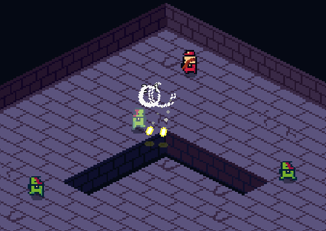

# Godot Game Template

A starting point and reference project for creating games with the Godot Engine, particularly suited for top-down shooter games.
Project is located in [addons/top_down](addons/top_down/) to keep project conflicts to a minimum. It showcases recommended project structure.

This repository also includes [addons/great_games_library](addons/great_games_library), a collection of scripts that offer general-purpose solutions applicable across various games.

Additionally, for task organization, the project includes a simple [Kanban Tasks - Todo Manager](https://godotengine.org/asset-library/asset/1474) plugin.

> **⚠️ CAUTION:**  
> Due to an issues with a custom `AudioBusLayout` resource locations in Godot, I've kept the audio bus layout at its default location and name as [default_bus_layout.tres](default_bus_layout.tres).

> **NOTE:**  
> - This template is not recommended for beginners who may need a guidance.  
> - It serves as my personal project template and will continue to evolve as I develop my own game. Updates will be made until the project starts to go beyond the needs of a generic top-down shooter and into game-specific content.
> - All assets are made by me and are free to be modified and used for inclusion in commercial products, but not sold as your creation. Soon will be released as a separate package on [nezvers.itch.io](https://nezvers.itch.io)

## Main Features
- Menu system
    - Full Screen
    - Audio (Master, Music, Sounds)
    - Button state style tweaning
- Pausing system
- Input Rebinding
- Frame by frame debug pausing (`P` - pause and advance, `[ + P` to unpause)
- Scene transition using shader on a screenshot
- Node reference managment [ReferenceNodeResource](addons/great_games_library/resources/ReferenceNodeResource/)
- Easy instancing with configuration callbacks and dynamic instance pooling [InstanceResource](addons/great_games_library/resources/InstanceResource/)
- Static functions for threaded loading [ThreadUtility](addons/great_games_library/static/ThreadUtility/ThreadUtility.gd)
- Sound effect system [SoundResource](addons/great_games_library/resources/SoundResource/) with autoloaded [SoundManager](addons/great_games_library/autoload/SoundManager.gd)
- Resource saving [SaveableResource](addons/great_games_library/resources/SaveableResource/SaveableResource.gd)
- Data transmission system used for damage, pickups, obstacles [AreaTransmitter](addons/great_games_library/nodes/AreaTransmitter/)
- Scene central data collection [ResourceNode](addons/great_games_library/nodes/ResourceNode/)
- Enemy AI Astar grid path finding
- Enemy wave spawning

## Recommendations
To have easier learning experience on how project works I would suggest to start with these scenes:
- Menu - addons/top_down/scenes/ui/screens/title.tscn
- Rooms - addons/top_down/scenes/levels/room_0.tscn
- Actors - addons/top_down/scenes/actors/actor.tscn
- Weapons - addons/top_down/scenes/weapons/weapon.tscn
- Projectiles - addons/top_down/scenes/projectiles/projectile.tscn
